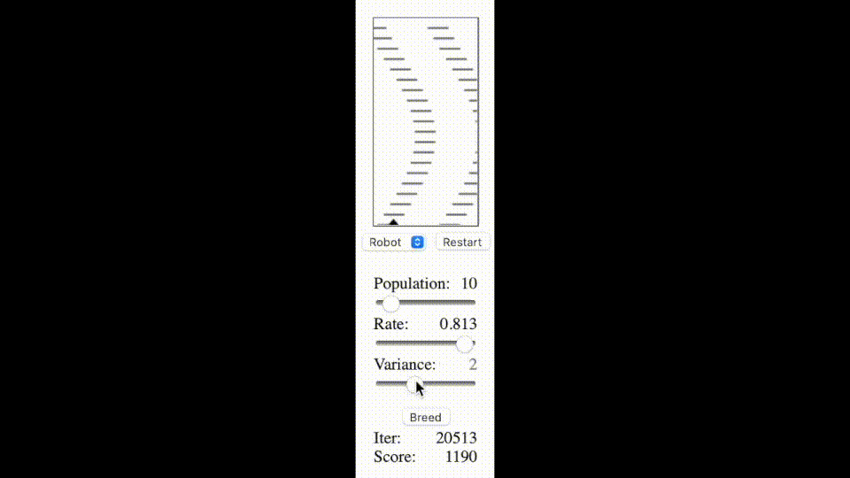

# racer-ml

This is a toy problem for practice with machine learning:
* a little triangle "racer" is traveling through space
* there are blocks in its way... it needs to maneuver to avoid collisions
* Its controls are thrust left and thrust right (acceleration.x). It's velocity.y is constant.
* Its sensors are an array of distance sensors spread out at five equal angles (from -60 to 60 degrees). They report "1/distance" to the racer's "brain."
* It must learn to avoid the blocks by adjusting its neural net parameters over multiple runs.

I used a genetic algorithm to search parameter space and train the racer's brain, which is just a fully-connected neural net with layers dimensions [5,4,9,3]. The output layer's argmax is used to determine thrust: [-1,0,1].

[Demo](https://loving-franklin-cd80e8.netlify.app)



## Install

```shell
npm install
```

## Usage

```shell
npm start
```

You play it yourself in "User" mode: use the left and right arrow keys to thrust the racer. Then, try running the genetic algorithm in "Robot" mode. After each iteration, you can test out the resulting racer by clicking "Start".

## Lessons learned:

- train each generation on the same track (don't randomize... too difficult to evaluate hyperparameters that way)
- design a track that weeds out the "dumb" nn's fast (i.e. serpentine track, graduated skill)
- better performance with 4 layers vs. three
- good performance when initial mutation rate is high (0.5), then taper down (think "explore then focus")